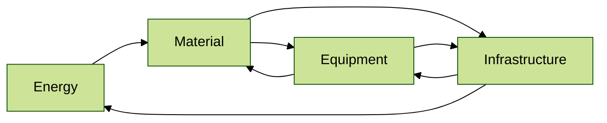
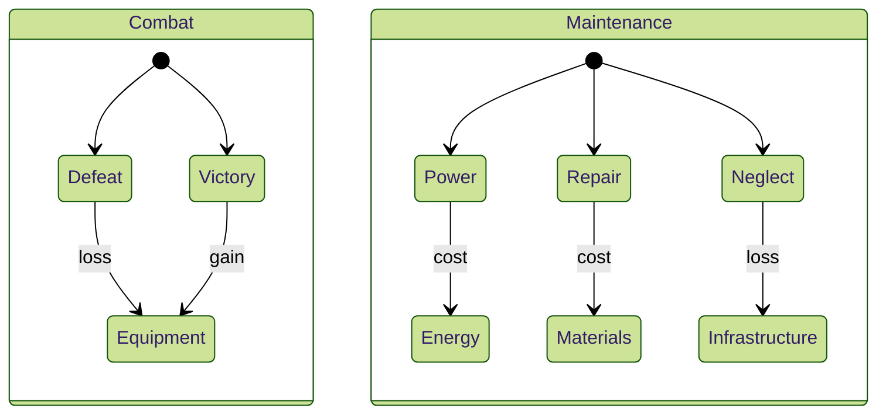
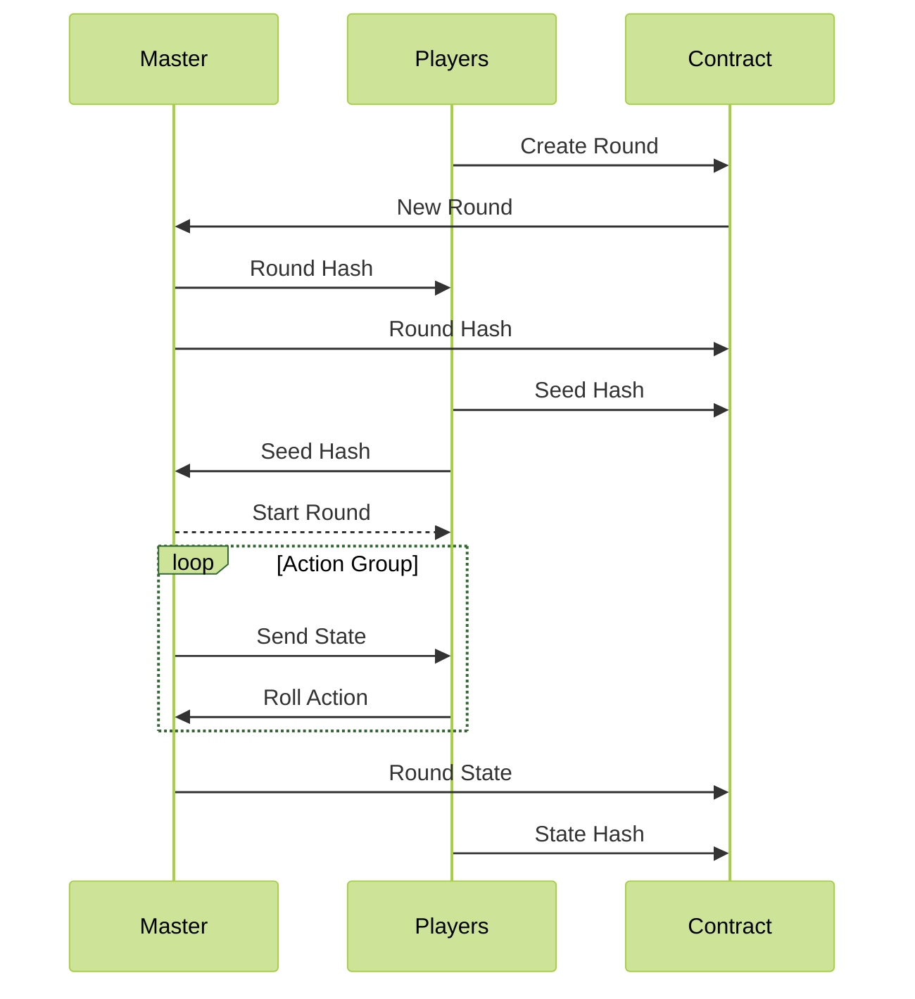

# Game Design

> *Game concepts that define and interact with the token economy.*

In short, the main gameplay loop follows: explore, expand, exploit, and exterminate. The players take actions to explore a region of space, with the goal to find points of interest that they can exploit, expand into, or just sell. While doing so they might encounter threads or competition they have to exterminate or can try to avoid.

All actions available in the game are designed to follow rules that could be played with some dice and paper, attributes and dice rolls determine the outcome. This results in gameplay that requires skill in assessing the situation and making the correct action calls combined with a bit of luck.

---
#### Game Loops

###### > Explore

Exploration can best be described as a [Hex Crawl](https://thealexandrian.net/wordpress/15156/roleplaying-games/game-structures-part-6-hexcrawls). The game world is split up into tiles using a hex grid. When players enter a new tile, dice are rolled, and info about the space around them is revealed. Based on this info, actions are to be taken, or one can try to move along.

The system is designed to make travel and exploration exciting and eventful; but also defines the rules and state that governs the game. It provides both players and game masters the means to manipulate the space around them by interacting with it in certain ways.

The state of a hex tile is defined by the sector it is in and what is around it. This state will hold lists of random encounters that are related to the zone that the tile is in. These lists can change based on the influence of other tiles and in turn that sphere of influence can be revealed or changed by actions or events.

###### > Exploite

Gathering random resources can be time-consuming and dangerous if not done with care or protection around. The more entrepreneurial spirits among the Arcians will set up infrastructure to harvest the resources around them and encourage safe passage for trade routes.

To exploit the space around you we define four main resource groups, Energy, Material, and Equipment. By linking these together an economy emerges.

###### > Expand

Before exploration can start the space needs to be defined, as actors mint their sections of space decisions are made and dice are rolled to define what can be found where and how things link up. After the initial setup Arcians expand their influence by building out new infrastructure or conquering what already exists. 

Both building out new infrastructure and conquering the old will come at a cost. This cost depends on the value of the node that is being built upon, or the infrastructure that is being conquered.

Besides the exchange of value, resources will have to be spent to facilitate the move and make a node your own.

###### > Exterminate

Extermination can be violent and rough, but it can also happen through neglect and decay. Staying active or hiring staff is required.

Starving regions of space of the resources required to maintain them can lead to infrastructure collapse. Cruel but effective and thus it is best not to anger your neighbors as you might depend on them.

---
#### Rolling the Dice

To keep actions cheap, secure, trust-less, and verifiable a dice rolling system with minimal on-chain events is employed. The system stores seeds for a [random number generator](https://www.geeksforgeeks.org/pseudo-random-number-generator-prng/) and tracks actions and counter actions taken by actors as required by the rules.

To reduce on-chain events and create a smooth experience actions are grouped in rounds. These rounds can be defined as encounters, events, or other groups of actions like movement, exploration, or conversation.

At the beginning of a round, hashes of seed values are stored on-chain so that the system can verify the initial state and results of actions taken after the encounter has played out.

The master in the graph above refers to a 'Game Master' (GM). These are network nodes organized as Proof of Stake Validators to manage the game state, rounds, and general services required to interact with the game. (Ownership of sectors is the stake required to participate)

These GMs also provide opposing rolls on actions taken and add extra entropy to prevent players from picking seeds that yield favorable results. Further securing the system and enabling trust-less single-play events and gameplay.

`No matter what action it is, dice will roll and heads may follow.`

---

Ref.
* [The Alexandrian - Hexcrawls - Game Structures](https://thealexandrian.net/wordpress/15156/roleplaying-games/game-structures-part-6-hexcrawls)
* [Geeks for Geeks - Pseudo-Random Number Generator](https://www.geeksforgeeks.org/pseudo-random-number-generator-prng/)
  