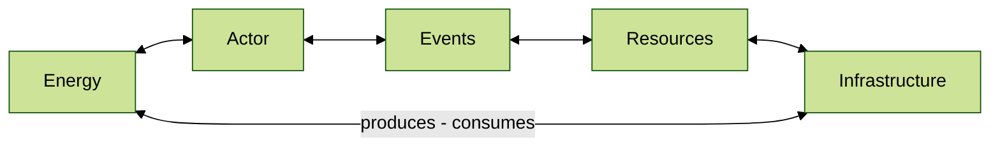

# Game Economy

To survive in this new world the player will have to claim their own place to live or rent space in one of the hubs managed by others. 

Every new arcian has enough energy available to look for a place to call home or to find a source of energy to stock up. In the end they will have to work to live or steal and grab what ever they can.

---
#### Energy Managment

> Energy is tracked on-chain, as a token it does not follow FT or NFT standards, and it is not desiged to be trade outside of the game.

Energy is the in game currency and has 6 decimal places, refered to a Microns. It powers the infrastructure that provides life to Arcians them self but it is also as a currency on ingame markets to trade services, materials, and some other goods.

```
1.000.000 Micron =
1 Credit or 1 Energy
```

The initial maximum total supply is 3.469.191.817 energy, this is a cap of 1 energy per map tile. This limits the amount of Arcians the universe can substain but also the infrastructure they can build in a given region of space based on the balance between the two.


| Item        |    Needs |    Time | { class="compact" }
|:----------- | --------:| -------:|
| 1 Actor     | 1 Energy | 10 days |
| 1 Base Node | 1 Energy | 10 days |

Where Actors are Arcians but can be both Player Characters (PCs) and Non-Player Characters (NPCs).

Stars and Infrastructures are the main sources of energy, depending on their composition or configuration they collect all energy from tiles with region space that is within their sphere of influence.

---
#### Infrastructure and Encounters

> Owned by Players and Creators, they follow the NFT standard (NEP-171) with extentions to act as logic modules for ARCs.


###### Encounters

Encounters act like story-line quests or simple repeatable missions that reward the players with materials, equipment, and experience.

These events the main source of income for players to earn their keep. They are random encounters or events that can be discovered when exploring space; once found they can be explored by the players or they can be soled on the local market. 

As tokenized assets they are made available by creators trough Operative <small>[(GMs)](/economics/#the-organisation)</small> and Regional <small>[(CMs)](/economics/#the-organisation)</small> nodes. As tokens they enable rewards for *user-generated-content* to be added and with verifiable outcomes that can reward players with in-game assets.

Most information found becomes less relable over time and events will expire after being deiscovered. Run, Sell or Lose them is the key that keep the event economy rolling.

###### Infrastructure

Hubs can be masive holding civilizations or just a small far out outpost in the middle of no where manage by a small band.

Build around sources of energy <small>[(Nodes)](/economics/#the-organisation)</small> for Arcians to live their lives these artificial structures are build to last. They act as the central hub for comunities to operate on and as a safe home to fall back on when things fall appart out in space.

Managing an active hub other players interact with will yield rewards to those that manage it. Allowing them to add more value to the node over time and mentain standing defences.


Failing to attract activity will put the metenace cost soly on those that own it, failing to keep up will result in decay and eventual loss of value and defences. It might be best to sell a hub at it's prime!

In the end decay is what keeps the economy rolling as it requires activity players or invites cheap takeovers.

---


